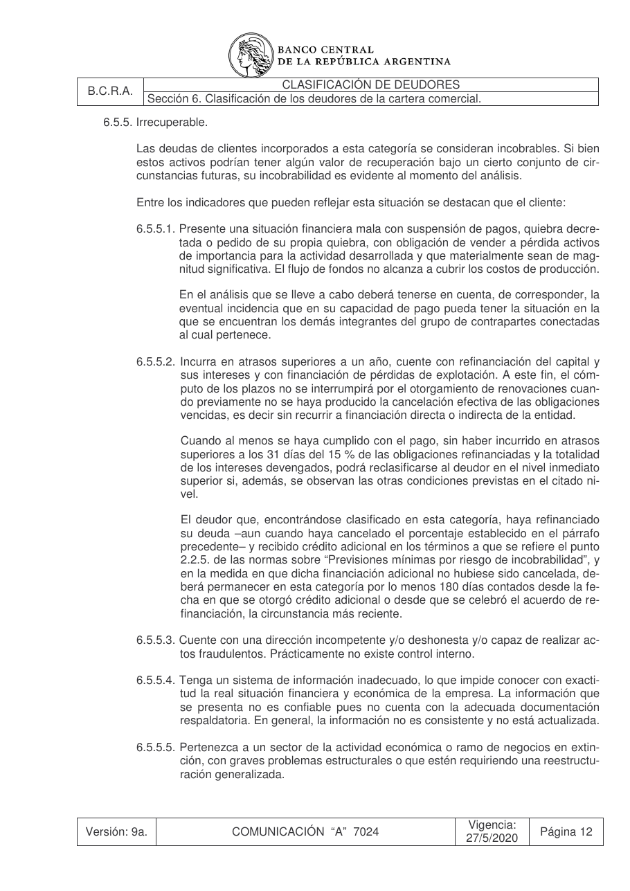

# Ficha L1-01 (lote 1, 1 de 20)

- Elemento: `Condicion_pago_del_15_sin_atrasos_mayores_a_31_dias__se_ha_cumplido_con_el_pago_sin_atraso_6acbec#u1`
- Nodo: Condicion, «Pago del 15 % sin atrasos mayores a 31 días»
- Descripción del nodo (salida del extractor; no es la referencia): «Se ha cumplido con el pago, sin atrasos superiores a 31 días, del 15 % de las obligaciones refinanciadas y la totalidad de los intereses devengados»

## Texto de la unidad de E0 (la referencia)

Unidad `cla::6.5.5.2`, «Incurra en atrasos superiores a un año, cuente con refinanciación del capital y», páginas [28]. PDF: `data/experiment/subset/TO_clasificacion_deudores_actual.pdf`.

La cuantía a juzgar va entre ⟦ ⟧.

**Texto propio** (páginas [28])

> 6.5.5.2. Incurra en atrasos superiores a un año, cuente con refinanciación del capital y
> sus intereses y con financiación de pérdidas de explotación. A este fin, el cóm-
> puto de los plazos no se interrumpirá por el otorgamiento de renovaciones cuan-
> do previamente no se haya producido la cancelación efectiva de las obligaciones
> vencidas, es decir sin recurrir a financiación directa o indirecta de la entidad.
> Cuando al menos se haya cumplido con el pago, sin haber incurrido en atrasos
> superiores a los 31 días del ⟦15 %⟧ de las obligaciones refinanciadas y la totalidad
> de los intereses devengados, podrá reclasificarse al deudor en el nivel inmediato
> superior si, además, se observan las otras condiciones previstas en el citado ni-
> vel.
> El deudor que, encontrándose clasificado en esta categoría, haya refinanciado
> su deuda –aun cuando haya cancelado el porcentaje establecido en el párrafo
> precedente– y recibido crédito adicional en los términos a que se refiere el punto
> 2.2.5. de las normas sobre “Previsiones mínimas por riesgo de incobrabilidad”, y
> en la medida en que dicha financiación adicional no hubiese sido cancelada, de-
> berá permanecer en esta categoría por lo menos 180 días contados desde la fe-
> cha en que se otorgó crédito adicional o desde que se celebró el acuerdo de re-
> financiación, la circunstancia más reciente.

**Heredado, bloque 1 (encabezado, de S6)** (páginas [17])

> Sección 6. Clasificación de los deudores de la cartera comercial.

**Heredado, bloque 2 (encabezado, de 6.5)** (páginas [19])

> 6.5. Niveles de clasificación.

**Heredado, bloque 3 (intro, de 6.5)** (páginas [19])

> Cada cliente, y la totalidad de sus financiaciones comprendidas, se incluirá en una de las si-
> guientes cinco categorías, las que se definen teniendo en cuenta las condiciones que se deta-
> llan en cada caso.
> Los clientes que no registren asistencia crediticia de la entidad y que posteriormente reciban fi-
> nanciaciones de ésta que no superen el importe resultante de aplicar sobre el saldo de deuda
> registrado en el sistema financiero, según la última información disponible en la “Central de
> deudores” a la fecha de su otorgamiento, el porcentaje establecido en el punto 2.2.5. de las
> normas sobre “Previsiones mínimas por riesgo de incobrabilidad” correspondiente a la peor cla-
> sificación asignada, podrán ser clasificados por la entidad teniendo en cuenta únicamente el
> análisis del flujo de fondos proyectado. Las asistencias así otorgadas no serán consideradas a
> los fines a que se refiere el punto 6.6.
> A fin de verificar el cumplimiento de las obligaciones sin recurrir a nueva financiación directa o
> indirecta o a refinanciaciones, no se considerarán refinanciaciones las facilidades adicionales
> que se otorguen respecto de los márgenes vigentes acordados, siempre que el nuevo apoyo
> crediticio implique nuevos desembolsos de fondos y no supere el 10 % del cupo asignado en
> oportunidad de la última evaluación crediticia del cliente, en la medida en que éstas sean con-
> sistentes con el curso normal de los negocios y exista capacidad para atender el resto de las
> obligaciones financieras, ni las nuevas financiaciones y las refinanciaciones asociadas a una
> mayor inversión derivada de la expansión de las actividades, y siempre que pueda demostrarse
> que el flujo de fondos proyectado permitirá afrontar la totalidad de sus obligaciones.
> Tampoco se considerarán dentro de ese concepto las refinanciaciones otorgadas a los produc-
> tores agropecuarios cuando ello resulte de la aplicación de disposiciones vinculadas a la Ley de
> Emergencia Agropecuaria, sin perjuicio de lo cual, a los fines de la clasificación, deberá tenerse
> en cuenta el flujo de fondos proyectado para el momento en que concluya la vigencia de la
> emergencia declarada. El tratamiento que se dispense en ese marco no podrá implicar mejora-
> miento de la clasificación asignada al cliente en función de su situación individual, preexistente
> a la emergencia, ni su aplicación extenderse más allá de la vigencia fijada para ella.

**Heredado, bloque 4 (encabezado, de 6.5.5)** (páginas [28])

> 6.5.5. Irrecuperable.

**Heredado, bloque 5 (intro, de 6.5.5)** (páginas [28])

> Las deudas de clientes incorporados a esta categoría se consideran incobrables. Si bien
> estos activos podrían tener algún valor de recuperación bajo un cierto conjunto de cir-
> cunstancias futuras, su incobrabilidad es evidente al momento del análisis.
> Entre los indicadores que pueden reflejar esta situación se destacan que el cliente:

**Heredado, bloque 6 (cierre, de 6.5.5)** (páginas [31])

> Además, corresponderá clasificar en esta categoría a los clientes que, cualquiera sea el
> motivo (entre ellos por no contar con legajo o por no haber proporcionado información
> confiable y/o actualizada), no hayan sido evaluados con la periodicidad correspondiente,
> con excepción de los deudores en concurso o con acuerdo preventivo extrajudicial solici-
> tado o en gestión judicial que, por un período de hasta 540 días contados a partir de la
> apertura del concurso, solicitud del acuerdo preventivo o inicio de las gestiones judiciales
> de cobro, según corresponda, no hubiesen presentado la documentación que permita
> realizarla, siempre que se cuente con informe de abogado de la entidad financiera
> acreedora sobre la razonabilidad del recupero de los créditos comprendidos.
> Ello, sin perjuicio de que se trate de deudas que reúnan todas las condiciones previstas
> por el punto 2.2.3.2. de las normas sobre “Previsiones mínimas por riesgo de incobrabili-
> dad”.

## Tramos de umbral que E1 devolvió para este nodo

Del crudo de E1 guardado en `corpus_tanda0/salida_r2b/cla/` (reintento_1: reintentos_e3.jsonl):

1. «atrasos superiores a los 31 días» (unidad `cla::6.5.5.2`)
2. «15 % de las obligaciones refinanciadas» (unidad `cla::6.5.5.2`) ← contiene lo resaltado

## Página del PDF

## Paso 1

Se responde en el formulario del lote (`formulario_paso1_lote1.md`), bloque L1-01.
