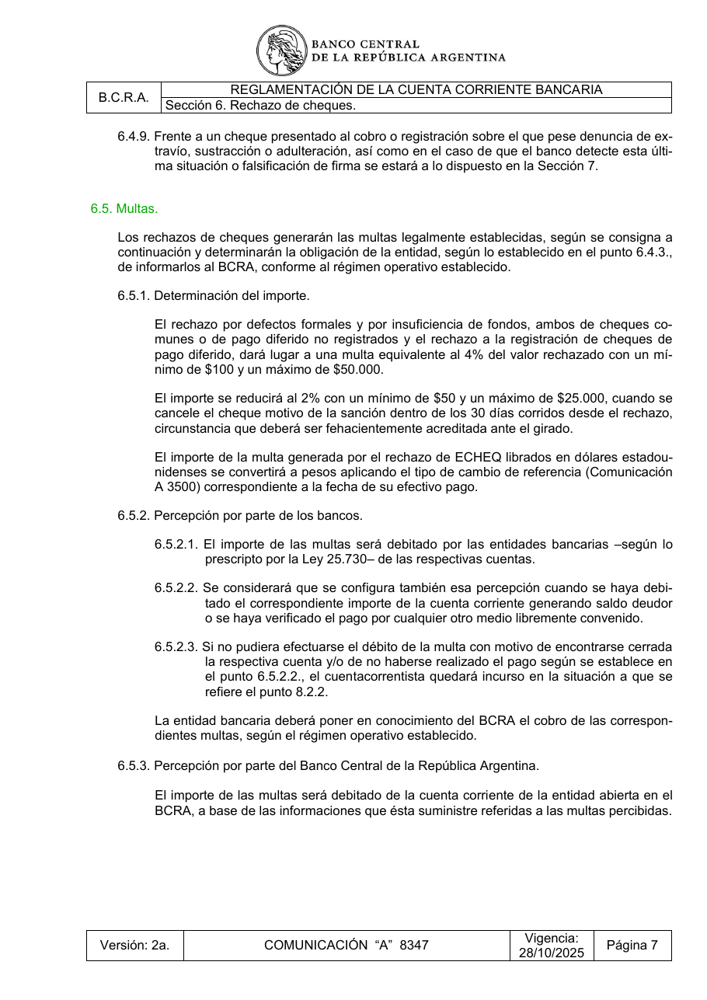

# Ficha L1-02 (lote 1, 2 de 20)

- Elemento: `Excepcion_reduccion_de_la_multa_al_2_con_minimo_de_50_y_maximo_de_25_000_cuando_se_cancela_d307d0#u3`
- Nodo: Excepcion, «Reducción a 2% — cancelación dentro de 30 días»
- Descripción del nodo (salida del extractor; no es la referencia): «Reducción de la multa al 2% con mínimo de $50 y máximo de $25.000 cuando se cancela el cheque dentro de 30 días corridos desde el rechazo»

## Texto de la unidad de E0 (la referencia)

Unidad `ctacte::6.5.1`, «Determinación del importe.», páginas [40]. PDF: `data/experiment/escalado_prep/pdfs/ctacte.pdf`.

La cuantía a juzgar va entre ⟦ ⟧.

**Texto propio** (páginas [40])

> 6.5.1. Determinación del importe.
> El rechazo por defectos formales y por insuficiencia de fondos, ambos de cheques co-
> munes o de pago diferido no registrados y el rechazo a la registración de cheques de
> pago diferido, dará lugar a una multa equivalente al 4% del valor rechazado con un mí-
> nimo de $100 y un máximo de $50.000.
> El importe se reducirá al 2% con un mínimo de $50 y un máximo de $25.000, cuando se
> cancele el cheque motivo de la sanción dentro de los ⟦30 días corridos⟧ desde el rechazo,
> circunstancia que deberá ser fehacientemente acreditada ante el girado.
> El importe de la multa generada por el rechazo de ECHEQ librados en dólares estadou-
> nidenses se convertirá a pesos aplicando el tipo de cambio de referencia (Comunicación
> A 3500) correspondiente a la fecha de su efectivo pago.

**Heredado, bloque 1 (encabezado, de S6)** (páginas [34])

> Sección 6. Rechazo de cheques.

**Heredado, bloque 2 (encabezado, de 6.5)** (páginas [40])

> 6.5. Multas.

**Heredado, bloque 3 (intro, de 6.5)** (páginas [40])

> Los rechazos de cheques generarán las multas legalmente establecidas, según se consigna a
> continuación y determinarán la obligación de la entidad, según lo establecido en el punto 6.4.3.,
> de informarlos al BCRA, conforme al régimen operativo establecido.

## Tramos de umbral que E1 devolvió para este nodo

Del crudo de E1 guardado en `corpus_tanda0/salida_r2b/ctacte/` (extracciones_e1_compact.jsonl):

1. «al 2%» (unidad `ctacte::6.5.1`)
2. «con un mínimo de $50» (unidad `ctacte::6.5.1`)
3. «un máximo de $25.000» (unidad `ctacte::6.5.1`)
4. «dentro de los 30 días corridos» (unidad `ctacte::6.5.1`) ← contiene lo resaltado

## Página del PDF

## Paso 1

Se responde en el formulario del lote (`formulario_paso1_lote1.md`), bloque L1-02.
