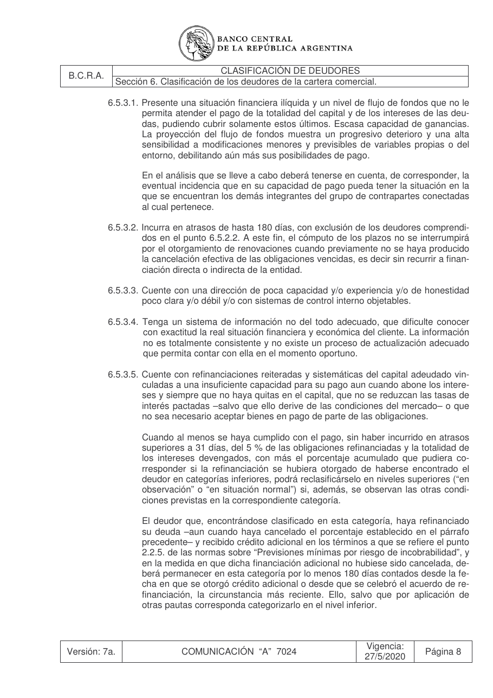

# Ficha L1-03 (lote 1, 3 de 20)

- Elemento: `Excepcion_no_aplica_la_permanencia_minima_de_180_dias_si_por_aplicacion_de_otras_pautas_co_b3f551#u0`
- Nodo: Excepcion, «Excepción a permanencia mínima 180 días por categorización inferior»
- Descripción del nodo (salida del extractor; no es la referencia): «No aplica la permanencia mínima de 180 días si por aplicación de otras pautas corresponde categorizar al deudor en el nivel inferior»

## Texto de la unidad de E0 (la referencia)

Unidad `cla::6.5.3.5`, «Cuente con refinanciaciones reiteradas y sistemáticas del capital adeudado vin-», páginas [24]. PDF: `data/experiment/subset/TO_clasificacion_deudores_actual.pdf`.

La cuantía a juzgar va entre ⟦ ⟧.

**Texto propio** (páginas [24])

> 6.5.3.5. Cuente con refinanciaciones reiteradas y sistemáticas del capital adeudado vin-
> culadas a una insuficiente capacidad para su pago aun cuando abone los intere-
> ses y siempre que no haya quitas en el capital, que no se reduzcan las tasas de
> interés pactadas –salvo que ello derive de las condiciones del mercado– o que
> no sea necesario aceptar bienes en pago de parte de las obligaciones.
> Cuando al menos se haya cumplido con el pago, sin haber incurrido en atrasos
> superiores a 31 días, del 5 % de las obligaciones refinanciadas y la totalidad de
> los intereses devengados, con más el porcentaje acumulado que pudiera co-
> rresponder si la refinanciación se hubiera otorgado de haberse encontrado el
> deudor en categorías inferiores, podrá reclasificárselo en niveles superiores (“en
> observación” o “en situación normal”) si, además, se observan las otras condi-
> ciones previstas en la correspondiente categoría.
> El deudor que, encontrándose clasificado en esta categoría, haya refinanciado
> su deuda –aun cuando haya cancelado el porcentaje establecido en el párrafo
> precedente– y recibido crédito adicional en los términos a que se refiere el punto
> 2.2.5. de las normas sobre “Previsiones mínimas por riesgo de incobrabilidad”, y
> en la medida en que dicha financiación adicional no hubiese sido cancelada, de-
> berá permanecer en esta categoría por lo menos ⟦180 días⟧ contados desde la fe-
> cha en que se otorgó crédito adicional o desde que se celebró el acuerdo de re-
> financiación, la circunstancia más reciente. Ello, salvo que por aplicación de
> otras pautas corresponda categorizarlo en el nivel inferior.

**Heredado, bloque 1 (encabezado, de S6)** (páginas [17])

> Sección 6. Clasificación de los deudores de la cartera comercial.

**Heredado, bloque 2 (encabezado, de 6.5)** (páginas [19])

> 6.5. Niveles de clasificación.

**Heredado, bloque 3 (intro, de 6.5)** (páginas [19])

> Cada cliente, y la totalidad de sus financiaciones comprendidas, se incluirá en una de las si-
> guientes cinco categorías, las que se definen teniendo en cuenta las condiciones que se deta-
> llan en cada caso.
> Los clientes que no registren asistencia crediticia de la entidad y que posteriormente reciban fi-
> nanciaciones de ésta que no superen el importe resultante de aplicar sobre el saldo de deuda
> registrado en el sistema financiero, según la última información disponible en la “Central de
> deudores” a la fecha de su otorgamiento, el porcentaje establecido en el punto 2.2.5. de las
> normas sobre “Previsiones mínimas por riesgo de incobrabilidad” correspondiente a la peor cla-
> sificación asignada, podrán ser clasificados por la entidad teniendo en cuenta únicamente el
> análisis del flujo de fondos proyectado. Las asistencias así otorgadas no serán consideradas a
> los fines a que se refiere el punto 6.6.
> A fin de verificar el cumplimiento de las obligaciones sin recurrir a nueva financiación directa o
> indirecta o a refinanciaciones, no se considerarán refinanciaciones las facilidades adicionales
> que se otorguen respecto de los márgenes vigentes acordados, siempre que el nuevo apoyo
> crediticio implique nuevos desembolsos de fondos y no supere el 10 % del cupo asignado en
> oportunidad de la última evaluación crediticia del cliente, en la medida en que éstas sean con-
> sistentes con el curso normal de los negocios y exista capacidad para atender el resto de las
> obligaciones financieras, ni las nuevas financiaciones y las refinanciaciones asociadas a una
> mayor inversión derivada de la expansión de las actividades, y siempre que pueda demostrarse
> que el flujo de fondos proyectado permitirá afrontar la totalidad de sus obligaciones.
> Tampoco se considerarán dentro de ese concepto las refinanciaciones otorgadas a los produc-
> tores agropecuarios cuando ello resulte de la aplicación de disposiciones vinculadas a la Ley de
> Emergencia Agropecuaria, sin perjuicio de lo cual, a los fines de la clasificación, deberá tenerse
> en cuenta el flujo de fondos proyectado para el momento en que concluya la vigencia de la
> emergencia declarada. El tratamiento que se dispense en ese marco no podrá implicar mejora-
> miento de la clasificación asignada al cliente en función de su situación individual, preexistente
> a la emergencia, ni su aplicación extenderse más allá de la vigencia fijada para ella.

**Heredado, bloque 4 (encabezado, de 6.5.3)** (páginas [23])

> 6.5.3. Con problemas.

**Heredado, bloque 5 (intro, de 6.5.3)** (páginas [23])

> El análisis del flujo de fondos del cliente demuestra que tiene problemas para atender
> normalmente la totalidad de sus compromisos financieros y que, de no ser corregidos,
> esos problemas pueden resultar en una pérdida para la entidad financiera.
> Entre los indicadores que pueden reflejar esta situación se destacan que el cliente:

## Tramos de umbral que E1 devolvió para este nodo

E1 no devolvió tramos de umbral para este nodo (crudo: extracciones_e1_compact.jsonl).

## Página del PDF

## Paso 1

Se responde en el formulario del lote (`formulario_paso1_lote1.md`), bloque L1-03.
