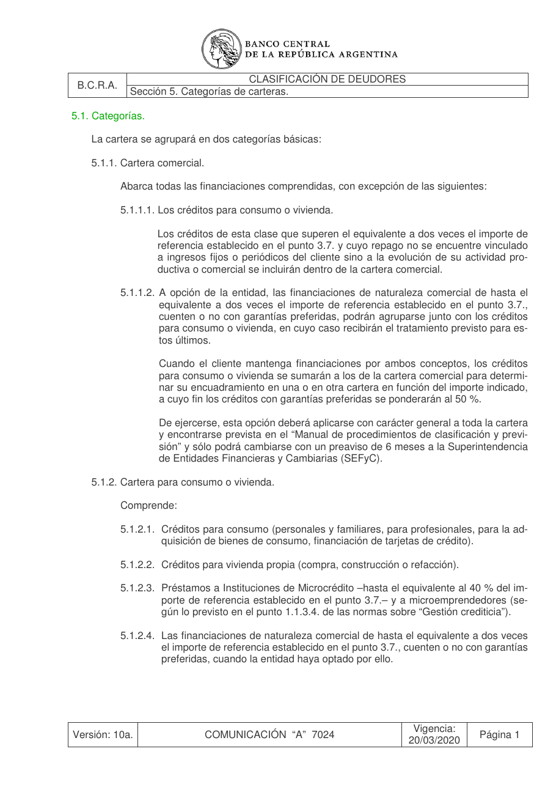

# Ficha L1-04 (lote 1, 4 de 20)

- Elemento: `Condicion_superar_dos_veces_importe_referencia_punto_3_7__el_credito_debe_superar_el_equiv_22a312#u0`
- Nodo: Condicion, «Superar dos veces importe referencia punto 3.7»
- Descripción del nodo (salida del extractor; no es la referencia): «El crédito debe superar el equivalente a dos veces el importe de referencia establecido en el punto 3.7.»

## Texto de la unidad de E0 (la referencia)

Unidad `cla::5.1.1.1`, «Los créditos para consumo o vivienda.», páginas [16]. PDF: `data/experiment/subset/TO_clasificacion_deudores_actual.pdf`.

La cuantía a juzgar va entre ⟦ ⟧.

**Texto propio** (páginas [16])

> 5.1.1.1. Los créditos para consumo o vivienda.
> Los créditos de esta clase que superen el equivalente a ⟦dos veces⟧ el importe de
> referencia establecido en el punto 3.7. y cuyo repago no se encuentre vinculado
> a ingresos fijos o periódicos del cliente sino a la evolución de su actividad pro-
> ductiva o comercial se incluirán dentro de la cartera comercial.

**Heredado, bloque 1 (encabezado, de S5)** (páginas [16])

> Sección 5. Categorías de carteras.

**Heredado, bloque 2 (encabezado, de 5.1)** (páginas [16])

> 5.1. Categorías.

**Heredado, bloque 3 (intro, de 5.1)** (páginas [16])

> La cartera se agrupará en dos categorías básicas:

**Heredado, bloque 4 (encabezado, de 5.1.1)** (páginas [16])

> 5.1.1. Cartera comercial.

**Heredado, bloque 5 (intro, de 5.1.1)** (páginas [16])

> Abarca todas las financiaciones comprendidas, con excepción de las siguientes:

## Tramos de umbral que E1 devolvió para este nodo

Del crudo de E1 guardado en `corpus_tanda0/salida_r2b/cla/` (extracciones_e1_compact.jsonl):

1. «superen el equivalente a dos veces el importe de referencia establecido en el punto 3.7» (unidad `cla::5.1.1.1`) ← contiene lo resaltado

## Página del PDF

## Paso 1

Se responde en el formulario del lote (`formulario_paso1_lote1.md`), bloque L1-04.
