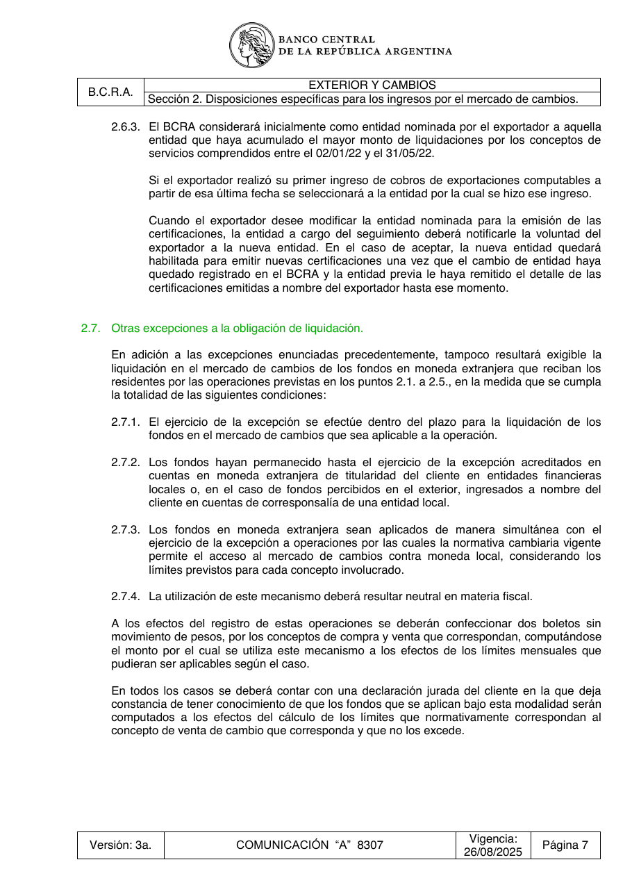

# Ficha L1-05 (lote 1, 5 de 20)

- Elemento: `Restriccion_los_fondos_que_se_aplican_bajo_esta_modalidad_no_deben_exceder_los_limites_que_n_74abe0#u0`
- Nodo: Restriccion, «Límite — fondos no exceden límites aplicables»
- Descripción del nodo (salida del extractor; no es la referencia): «Los fondos que se aplican bajo esta modalidad no deben exceder los límites que normativamente correspondan al concepto de venta de cambio que corresponda.»

## Texto de la unidad de E0 (la referencia)

Unidad `ext::2.7::cierre`, «[bloque cierre] Otras excepciones a la obligación de liquidación.», páginas [14]. PDF: `data/experiment/subset/TO_exterior_cambios_actual.pdf`.

El tramo del elemento va entre ⟦ ⟧.

**Texto propio** (páginas [14])

> A los efectos del registro de estas operaciones se deberán confeccionar dos boletos sin
> movimiento de pesos, por los conceptos de compra y venta que correspondan, computándose
> el monto por el cual se utiliza este mecanismo a los efectos de los límites mensuales que
> pudieran ser aplicables según el caso.
> En todos los casos se deberá contar con una declaración jurada del cliente en la que deja
> constancia de tener conocimiento de que los fondos que se aplican bajo esta modalidad serán
> computados a los efectos del cálculo de los límites que normativamente correspondan al
> concepto de venta de cambio que corresponda y que ⟦no los excede⟧.

**Heredado, bloque 1 (encabezado, de S2)** (páginas [8])

> Sección 2. Disposiciones específicas para los ingresos por el mercado de cambios.

**Heredado, bloque 2 (encabezado, de 2.7)** (páginas [14])

> 2.7. Otras excepciones a la obligación de liquidación.

## Tramos de umbral que E1 devolvió para este nodo

Del crudo de E1 guardado en `corpus_tanda0/salida_r2b/ext/` (reintento_1: reintentos_e3.jsonl):

1. «no los excede» (unidad `ext::2.7::cierre`) ← contiene lo resaltado

## Página del PDF

## Paso 1

Se responde en el formulario del lote (`formulario_paso1_lote1.md`), bloque L1-05.
