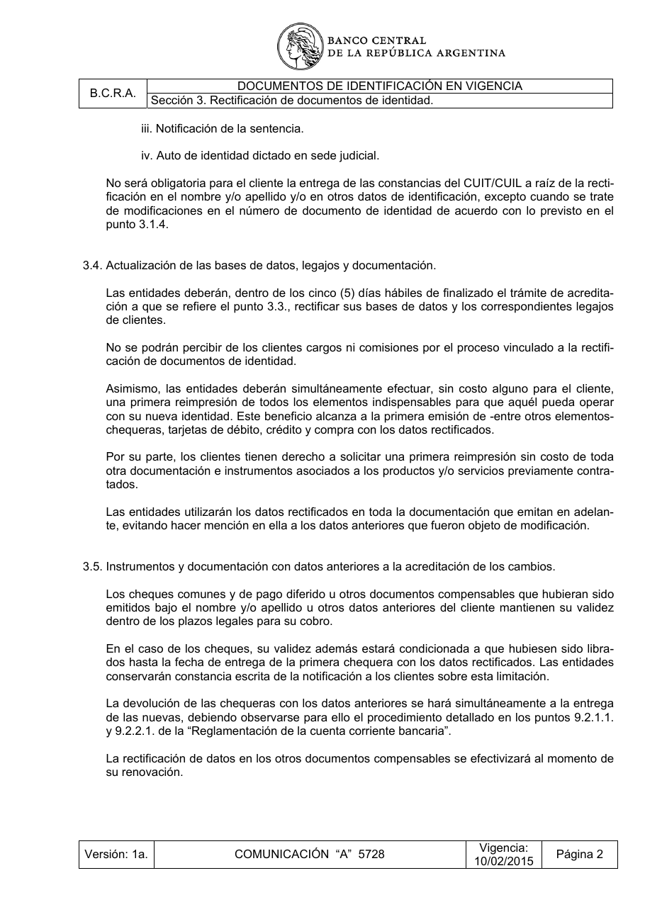

# Ficha L1-06 (lote 1, 6 de 20)

- Elemento: `Obligacion_rectificar_bases_de_datos_y_legajos_de_clientes_dentro_de_cinco_dias_habiles_de__e41239#u0`
- Nodo: Obligacion, «Rectificación de bases de datos y legajos»
- Descripción del nodo (salida del extractor; no es la referencia): «Rectificar bases de datos y legajos de clientes dentro de cinco días hábiles de finalizado el trámite de acreditación»

## Texto de la unidad de E0 (la referencia)

Unidad `docvig::3.4`, «Actualización de las bases de datos, legajos y documentación.», páginas [8]. PDF: `data/experiment/escalado_prep/pdfs/docvig.pdf`.

La cuantía a juzgar va entre ⟦ ⟧.

**Texto propio** (páginas [8])

> 3.4. Actualización de las bases de datos, legajos y documentación.
> Las entidades deberán, dentro de los ⟦cinco (5) días hábiles⟧ de finalizado el trámite de acredita-
> ción a que se refiere el punto 3.3., rectificar sus bases de datos y los correspondientes legajos
> de clientes.
> No se podrán percibir de los clientes cargos ni comisiones por el proceso vinculado a la rectifi-
> cación de documentos de identidad.
> Asimismo, las entidades deberán simultáneamente efectuar, sin costo alguno para el cliente,
> una primera reimpresión de todos los elementos indispensables para que aquél pueda operar
> con su nueva identidad. Este beneficio alcanza a la primera emisión de -entre otros elementos-
> chequeras, tarjetas de débito, crédito y compra con los datos rectificados.
> Por su parte, los clientes tienen derecho a solicitar una primera reimpresión sin costo de toda
> otra documentación e instrumentos asociados a los productos y/o servicios previamente contra-
> tados.
> Las entidades utilizarán los datos rectificados en toda la documentación que emitan en adelan-
> te, evitando hacer mención en ella a los datos anteriores que fueron objeto de modificación.

**Heredado, bloque 1 (encabezado, de S3)** (páginas [7])

> Sección 3. Rectificación de documentos de identidad.

## Tramos de umbral que E1 devolvió para este nodo

Del crudo de E1 guardado en `corpus_tanda0/salida_r2b/docvig/` (extracciones_e1_compact.jsonl):

1. «dentro de los cinco (5) días hábiles» (unidad `docvig::3.4`) ← contiene lo resaltado

## Página del PDF

## Paso 1

Se responde en el formulario del lote (`formulario_paso1_lote1.md`), bloque L1-06.
