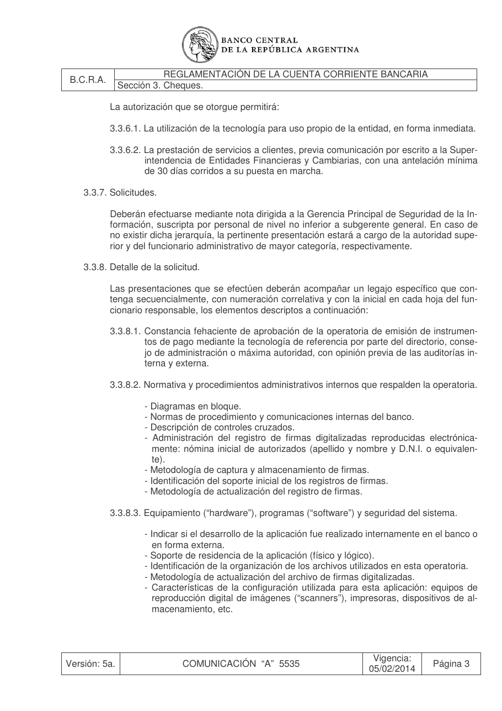

# Ficha L1-08 (lote 1, 8 de 20)

- Elemento: `Condicion_previa_comunicacion_a_la_superintendencia__la_prestacion_de_servicios_a_clientes_66b48c#u0`
- Nodo: Condicion, «Previa comunicación a la Superintendencia»
- Descripción del nodo (salida del extractor; no es la referencia): «La prestación de servicios a clientes está condicionada a la comunicación previa por escrito a la Superintendencia con antelación mínima de 30 días corridos»

## Texto de la unidad de E0 (la referencia)

Unidad `ctacte::3.3.6.2`, «La prestación de servicios a clientes, previa comunicación por escrito a la Super-», páginas [22]. PDF: `data/experiment/escalado_prep/pdfs/ctacte.pdf`.

La cuantía a juzgar va entre ⟦ ⟧.

**Texto propio** (páginas [22])

> 3.3.6.2. La prestación de servicios a clientes, previa comunicación por escrito a la Super-
> intendencia de Entidades Financieras y Cambiarias, con una antelación mínima
> de ⟦30 días corridos⟧ a su puesta en marcha.

**Heredado, bloque 1 (encabezado, de S3)** (páginas [20])

> Sección 3. Cheques.

**Heredado, bloque 2 (encabezado, de 3.3)** (páginas [21])

> 3.3. Reproducción de firmas digitalizadas para el libramiento de cheques en formato papel.

**Heredado, bloque 3 (encabezado, de 3.3.6)** (páginas [21])

> 3.3.6. Autorización.

**Heredado, bloque 4 (intro, de 3.3.6)** (páginas [21, 22])

> El BCRA autorizará individualmente para utilizar dichos sistemas a los bancos que lo so-
> liciten.
> La autorización que se otorgue permitirá:

## Tramos de umbral que E1 devolvió para este nodo

Del crudo de E1 guardado en `corpus_tanda0/salida_r2b/ctacte/` (extracciones_e1_compact.jsonl):

1. «con una antelación mínima de 30 días corridos» (unidad `ctacte::3.3.6.2`) ← contiene lo resaltado

## Página del PDF

## Paso 1

Se responde en el formulario del lote (`formulario_paso1_lote1.md`), bloque L1-08.
