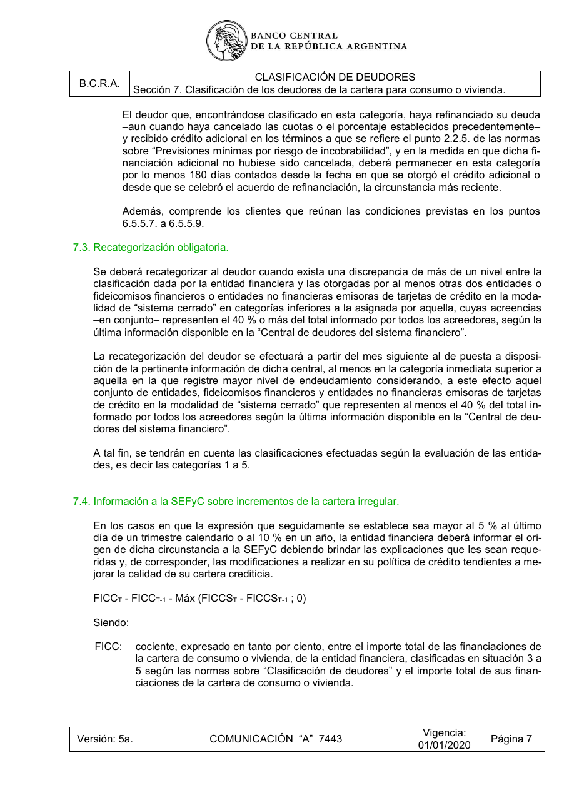

# Ficha L1-09 (lote 1, 9 de 20)

- Elemento: `Obligacion_deber_de_efectuar_la_recategorizacion_del_deudor_a_partir_del_mes_siguiente_al_d_9de9fe#u0`
- Nodo: Obligacion, «Efectuar recategorización — mes siguiente a disponibilidad de información»
- Descripción del nodo (salida del extractor; no es la referencia): «Deber de efectuar la recategorización del deudor a partir del mes siguiente al de puesta a disposición de la información de la Central de deudores, al menos en la categoría inmediata superior a aquella en la que registre mayor nivel de endeudamiento, considerando el conjunto de entidades, fideicomisos financieros y entidades no financieras emisoras de tarjetas de crédito en modalidad de sistema cerrado que representen al menos el 40 % del total informado por todos los acreedores.»

## Texto de la unidad de E0 (la referencia)

Unidad `cla::7.3`, «Recategorización obligatoria.», páginas [39]. PDF: `data/experiment/subset/TO_clasificacion_deudores_actual.pdf`.

El tramo del elemento va entre ⟦ ⟧.

**Texto propio** (páginas [39])

> 7.3. Recategorización obligatoria.
> Se deberá recategorizar al deudor cuando exista una discrepancia de más de un nivel entre la
> clasificación dada por la entidad financiera y las otorgadas por al menos otras dos entidades o
> fideicomisos financieros o entidades no financieras emisoras de tarjetas de crédito en la moda-
> lidad de “sistema cerrado” en categorías inferiores a la asignada por aquella, cuyas acreencias
> –en conjunto– representen el 40 % o más del total informado por todos los acreedores, según la
> última información disponible en la “Central de deudores del sistema financiero”.
> La recategorización del deudor se efectuará ⟦a partir del mes siguiente al de puesta a disposi-
> ción de la pertinente información⟧ de dicha central, al menos en la categoría inmediata superior a
> aquella en la que registre mayor nivel de endeudamiento considerando, a este efecto aquel
> conjunto de entidades, fideicomisos financieros y entidades no financieras emisoras de tarjetas
> de crédito en la modalidad de “sistema cerrado” que representen al menos el 40 % del total in-
> formado por todos los acreedores según la última información disponible en la “Central de deu-
> dores del sistema financiero”.
> A tal fin, se tendrán en cuenta las clasificaciones efectuadas según la evaluación de las entida-
> des, es decir las categorías 1 a 5.

**Heredado, bloque 1 (encabezado, de S7)** (páginas [33])

> Sección 7. Clasificación de los deudores de la cartera para consumo o vivienda.

## Tramos de umbral que E1 devolvió para este nodo

Del crudo de E1 guardado en `corpus_tanda0/salida_r2b/cla/` (extracciones_e1_compact.jsonl):

1. «a partir del mes siguiente al de puesta a disposición de la pertinente información» (unidad `cla::7.3`) ← contiene lo resaltado
2. «al menos en la categoría inmediata superior» (unidad `cla::7.3`)
3. «al menos el 40 % del total informado por todos los acreedores» (unidad `cla::7.3`)

## Página del PDF

## Paso 1

Se responde en el formulario del lote (`formulario_paso1_lote1.md`), bloque L1-09, con la pregunta única del §2.5.
