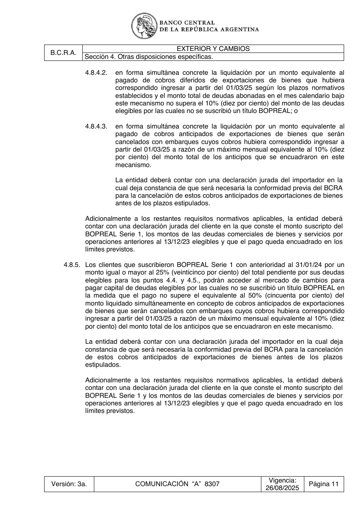

# Ficha L1-10 (lote 1, 10 de 20)

- Elemento: `Restriccion_maximo_mensual_equivalente_al_10_del_monto_total_de_los_anticipos_que_se_encuadr_b443cc#u0`
- Nodo: Restriccion, «Límite máximo mensual 10% anticipos encuadrados»
- Descripción del nodo (salida del extractor; no es la referencia): «Máximo mensual equivalente al 10% del monto total de los anticipos que se encuadraron en este mecanismo»

## Texto de la unidad de E0 (la referencia)

Unidad `ext::4.8.5`, «Los clientes que suscribieron BOPREAL Serie 1 con anterioridad al 31/01/24 por un», páginas [66]. PDF: `data/experiment/subset/TO_exterior_cambios_actual.pdf`.

La cuantía a juzgar va entre ⟦ ⟧.

**Texto propio** (páginas [66])

> 4.8.5. Los clientes que suscribieron BOPREAL Serie 1 con anterioridad al 31/01/24 por un
> monto igual o mayor al 25% (veinticinco por ciento) del total pendiente por sus deudas
> elegibles para los puntos 4.4. y 4.5., podrán acceder al mercado de cambios para
> pagar capital de deudas elegibles por las cuales no se suscribió un título BOPREAL en
> la medida que el pago no supere el equivalente al 50% (cincuenta por ciento) del
> monto liquidado simultáneamente en concepto de cobros anticipados de exportaciones
> de bienes que serán cancelados con embarques cuyos cobros hubiera correspondido
> ingresar a partir del 01/03/25 a razón de un máximo mensual equivalente al ⟦10%⟧ (diez
> por ciento) del monto total de los anticipos que se encuadraron en este mecanismo.
> La entidad deberá contar con una declaración jurada del importador en la cual deja
> constancia de que será necesaria la conformidad previa del BCRA para la cancelación
> de estos cobros anticipados de exportaciones de bienes antes de los plazos
> estipulados.
> Adicionalmente a los restantes requisitos normativos aplicables, la entidad deberá
> contar con una declaración jurada del cliente en la que conste el monto suscripto del
> BOPREAL Serie 1 y los montos de las deudas comerciales de bienes y servicios por
> operaciones anteriores al 13/12/23 elegibles y que el pago queda encuadrado en los
> límites previstos.

**Heredado, bloque 1 (encabezado, de S4)** (páginas [56])

> Sección 4. Otras disposiciones específicas.

**Heredado, bloque 2 (encabezado, de 4.8)** (páginas [64])

> 4.8. Disposiciones complementarias asociadas a los Bonos para la Reconstrucción de una

**Heredado, bloque 3 (intro, de 4.8)** (páginas [64])

> Argentina Libre (BOPREAL).

## Tramos de umbral que E1 devolvió para este nodo

Del crudo de E1 guardado en `corpus_tanda0/salida_r2b/ext/` (reintento_1: reintentos_e3.jsonl):

1. «un máximo mensual equivalente al 10% (diez por ciento) del monto total de los anticipos que se encuadraron en este mecanismo» (unidad `ext::4.8.5`) ← contiene lo resaltado

## Página del PDF

## Paso 1

Se responde en el formulario del lote (`formulario_paso1_lote1.md`), bloque L1-10.
