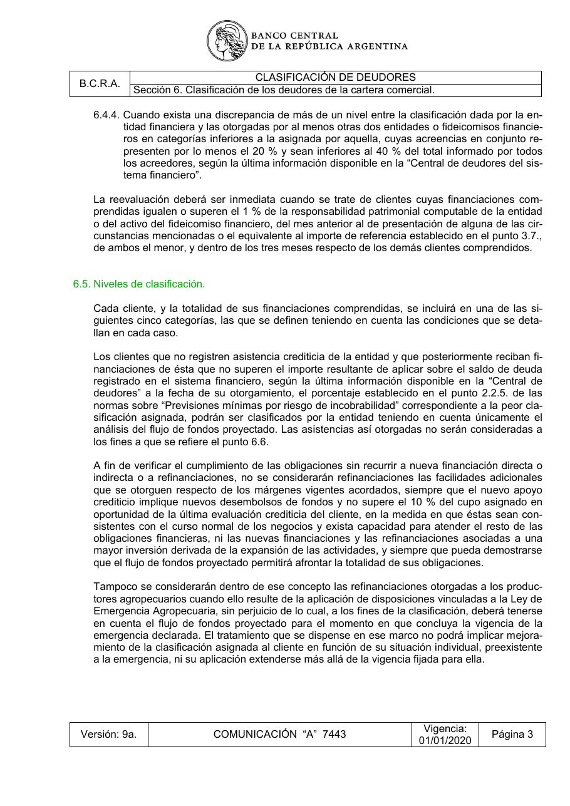

# Ficha L1-11 (lote 1, 11 de 20)

- Elemento: `Obligacion_analizar_dejando_constancia_fundamentada_de_la_decision_adoptada_en_el_legajo_de_74e6cb#u1`
- Nodo: Obligacion, «Analizar y modificar clasificación — discrepancia de nivel»
- Descripción del nodo (salida del extractor; no es la referencia): «Analizar dejando constancia fundamentada de la decisión adoptada en el legajo del cliente y, de ser necesario, modificar la clasificación cuando exista una discrepancia de más de un nivel entre la clasificación dada por la entidad financiera y las otorgadas por al menos otras dos entidades o fideicomisos financieros en categorías inferiores, cuyas acreencias en conjunto representen por lo menos el 20 % e inferiores al 40 % del total informado»

## Texto de la unidad de E0 (la referencia)

Unidad `cla::6.4.4`, «Cuando exista una discrepancia de más de un nivel entre la clasificación dada por la en-», páginas [19]. PDF: `data/experiment/subset/TO_clasificacion_deudores_actual.pdf`.

La cuantía a juzgar va entre ⟦ ⟧.

**Texto propio** (páginas [19])

> 6.4.4. Cuando exista una discrepancia de más de un nivel entre la clasificación dada por la en-
> tidad financiera y las otorgadas por al menos otras dos entidades o fideicomisos financie-
> ros en categorías inferiores a la asignada por aquella, cuyas acreencias en conjunto re-
> presenten por lo menos el 20 % y sean inferiores al ⟦40 %⟧ del total informado por todos
> los acreedores, según la última información disponible en la “Central de deudores del sis-
> tema financiero”.

**Heredado, bloque 1 (encabezado, de S6)** (páginas [17])

> Sección 6. Clasificación de los deudores de la cartera comercial.

**Heredado, bloque 2 (encabezado, de 6.4)** (páginas [18])

> 6.4. Reconsideración obligatoria de la clasificación.

**Heredado, bloque 3 (intro, de 6.4)** (páginas [18])

> En forma adicional a la periodicidad mínima expuesta precedentemente, se deberá analizar de-
> jando constancia fundamentada de la decisión adoptada en el legajo del cliente– y, de ser ne-
> cesario, modificar la clasificación cada vez que tenga lugar alguna de las siguientes circunstan-
> cias:

**Heredado, bloque 4 (cierre, de 6.4)** (páginas [19])

> La reevaluación deberá ser inmediata cuando se trate de clientes cuyas financiaciones com-
> prendidas igualen o superen el 1 % de la responsabilidad patrimonial computable de la entidad
> o del activo del fideicomiso financiero, del mes anterior al de presentación de alguna de las cir-
> cunstancias mencionadas o el equivalente al importe de referencia establecido en el punto 3.7.,
> de ambos el menor, y dentro de los tres meses respecto de los demás clientes comprendidos.

## Tramos de umbral que E1 devolvió para este nodo

E1 no devolvió tramos de umbral para este nodo (crudo: extracciones_e1_compact.jsonl).

## Página del PDF

## Paso 1

Se responde en el formulario del lote (`formulario_paso1_lote1.md`), bloque L1-11.
