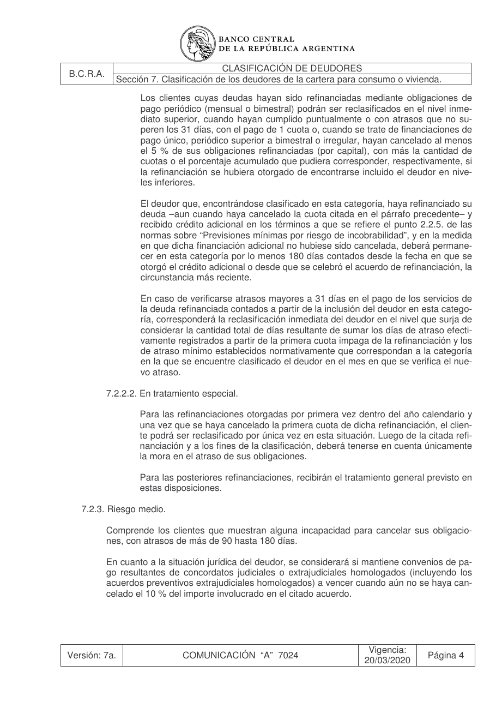
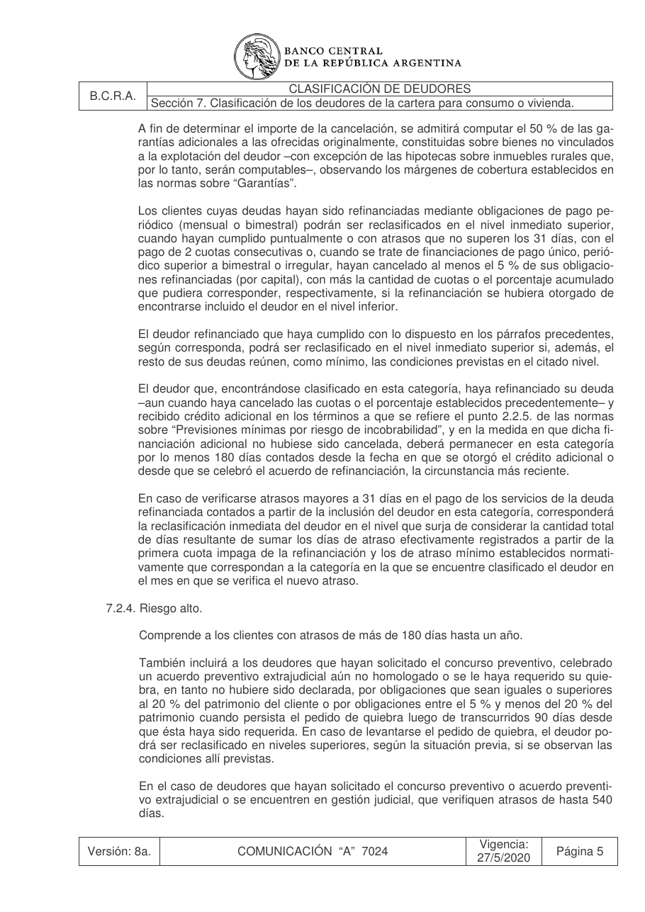

# Ficha L1-12 (lote 1, 12 de 20)

- Elemento: `Condicion_reclasificacion_deudas_refinanciadas_con_pago_periodico__condicion_para_reclasif_b6f00e#u1`
- Nodo: Condicion, «Reclasificación — deudas refinanciadas con pago periódico»
- Descripción del nodo (salida del extractor; no es la referencia): «Condición para reclasificación de deudores cuyas deudas hayan sido refinanciadas mediante obligaciones de pago periódico (mensual o bimestral): cumplimiento puntual o con atrasos que no superen los 31 días, con el pago de 2 cuotas consecutivas.»

## Texto de la unidad de E0 (la referencia)

Unidad `cla::7.2.3`, «Riesgo medio.», páginas [36, 37]. PDF: `data/experiment/subset/TO_clasificacion_deudores_actual.pdf`.

La cuantía a juzgar va entre ⟦ ⟧.

**Texto propio** (páginas [36, 37])

> 7.2.3. Riesgo medio.
> Comprende los clientes que muestran alguna incapacidad para cancelar sus obligacio-
> nes, con atrasos de más de 90 hasta 180 días.
> En cuanto a la situación jurídica del deudor, se considerará si mantiene convenios de pa-
> go resultantes de concordatos judiciales o extrajudiciales homologados (incluyendo los
> acuerdos preventivos extrajudiciales homologados) a vencer cuando aún no se haya can-
> celado el 10 % del importe involucrado en el citado acuerdo.
> A fin de determinar el importe de la cancelación, se admitirá computar el 50 % de las ga-
> rantías adicionales a las ofrecidas originalmente, constituidas sobre bienes no vinculados
> a la explotación del deudor –con excepción de las hipotecas sobre inmuebles rurales que,
> por lo tanto, serán computables–, observando los márgenes de cobertura establecidos en
> las normas sobre “Garantías”.
> Los clientes cuyas deudas hayan sido refinanciadas mediante obligaciones de pago pe-
> riódico (mensual o bimestral) podrán ser reclasificados en el nivel inmediato superior,
> cuando hayan cumplido puntualmente o con atrasos que no superen los ⟦31 días⟧, con el
> pago de 2 cuotas consecutivas o, cuando se trate de financiaciones de pago único, perió-
> dico superior a bimestral o irregular, hayan cancelado al menos el 5 % de sus obligacio-
> nes refinanciadas (por capital), con más la cantidad de cuotas o el porcentaje acumulado
> que pudiera corresponder, respectivamente, si la refinanciación se hubiera otorgado de
> encontrarse incluido el deudor en el nivel inferior.
> El deudor refinanciado que haya cumplido con lo dispuesto en los párrafos precedentes,
> según corresponda, podrá ser reclasificado en el nivel inmediato superior si, además, el
> resto de sus deudas reúnen, como mínimo, las condiciones previstas en el citado nivel.
> El deudor que, encontrándose clasificado en esta categoría, haya refinanciado su deuda
> –aun cuando haya cancelado las cuotas o el porcentaje establecidos precedentemente– y
> recibido crédito adicional en los términos a que se refiere el punto 2.2.5. de las normas
> sobre “Previsiones mínimas por riesgo de incobrabilidad”, y en la medida en que dicha fi-
> nanciación adicional no hubiese sido cancelada, deberá permanecer en esta categoría
> por lo menos 180 días contados desde la fecha en que se otorgó el crédito adicional o
> desde que se celebró el acuerdo de refinanciación, la circunstancia más reciente.
> En caso de verificarse atrasos mayores a 31 días en el pago de los servicios de la deuda
> refinanciada contados a partir de la inclusión del deudor en esta categoría, corresponderá
> la reclasificación inmediata del deudor en el nivel que surja de considerar la cantidad total
> de días resultante de sumar los días de atraso efectivamente registrados a partir de la
> primera cuota impaga de la refinanciación y los de atraso mínimo establecidos normati-
> vamente que correspondan a la categoría en la que se encuentre clasificado el deudor en
> el mes en que se verifica el nuevo atraso.

**Heredado, bloque 1 (encabezado, de S7)** (páginas [33])

> Sección 7. Clasificación de los deudores de la cartera para consumo o vivienda.

**Heredado, bloque 2 (encabezado, de 7.2)** (páginas [35])

> 7.2. Niveles de clasificación.

## Tramos de umbral que E1 devolvió para este nodo

Del crudo de E1 guardado en `corpus_tanda0/salida_r2b/cla/` (extracciones_e1_compact.jsonl):

1. «atrasos que no superen los 31 días» (unidad `cla::7.2.3`) ← contiene lo resaltado
2. «2 cuotas consecutivas» (unidad `cla::7.2.3`)

## Página del PDF

## Paso 1

Se responde en el formulario del lote (`formulario_paso1_lote1.md`), bloque L1-12.
