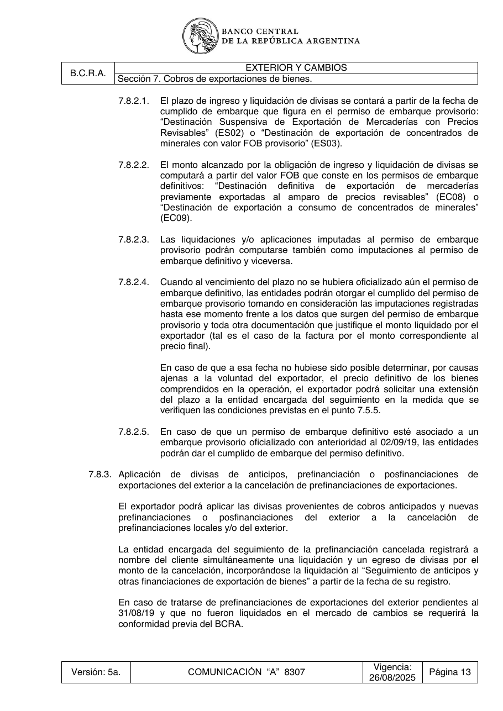

# Ficha L1-13 (lote 1, 13 de 20)

- Elemento: `Condicion_prefinanciaciones_del_exterior_pendientes_al_31_08_19_no_liquidadas__cuando_se_t_3bd7bb#u0`
- Nodo: Condicion, «Prefinanciaciones del exterior pendientes al 31/08/19 no liquidadas»
- Descripción del nodo (salida del extractor; no es la referencia): «Cuando se trate de prefinanciaciones de exportaciones del exterior pendientes al 31/08/19 que no fueron liquidadas en el mercado de cambios.»

## Texto de la unidad de E0 (la referencia)

Unidad `ext::7.8.3`, «Aplicación de divisas de anticipos, prefinanciación o posfinanciaciones de», páginas [92]. PDF: `data/experiment/subset/TO_exterior_cambios_actual.pdf`.

El tramo del elemento va entre ⟦ ⟧.

**Texto propio** (páginas [92])

> 7.8.3. Aplicación de divisas de anticipos, prefinanciación o posfinanciaciones de
> exportaciones del exterior a la cancelación de prefinanciaciones de exportaciones.
> El exportador podrá aplicar las divisas provenientes de cobros anticipados y nuevas
> prefinanciaciones o posfinanciaciones del exterior a la cancelación de
> prefinanciaciones locales y/o del exterior.
> La entidad encargada del seguimiento de la prefinanciación cancelada registrará a
> nombre del cliente simultáneamente una liquidación y un egreso de divisas por el
> monto de la cancelación, incorporándose la liquidación al “Seguimiento de anticipos y
> otras financiaciones de exportación de bienes” a partir de la fecha de su registro.
> En caso de tratarse de prefinanciaciones de exportaciones del exterior ⟦pendientes al
> 31/08/19⟧ y que no fueron liquidados en el mercado de cambios se requerirá la
> conformidad previa del BCRA.

**Heredado, bloque 1 (encabezado, de S7)** (páginas [80])

> Sección 7. Cobros de exportaciones de bienes.

**Heredado, bloque 2 (encabezado, de 7.8)** (páginas [91])

> 7.8. Otras disposiciones.

## Tramos de umbral que E1 devolvió para este nodo

Del crudo de E1 guardado en `corpus_tanda0/salida_r2b/ext/` (extracciones_e1_compact.jsonl):

1. «pendientes al 31/08/19» (unidad `ext::7.8.3`) ← contiene lo resaltado

## Página del PDF

## Paso 1

Se responde en el formulario del lote (`formulario_paso1_lote1.md`), bloque L1-13, con la pregunta única del §2.5.
