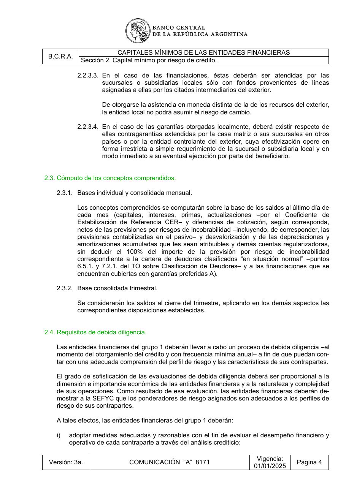

# Ficha L1-15 (lote 1, 15 de 20)

- Elemento: `Restriccion_restriccion_cualitativa_no_se_deducira_el_100_del_importe_de_la_prevision_por_ri_84bc1f#u0`
- Nodo: Restriccion, «No deducir 100% previsión deudores situación normal»
- Descripción del nodo (salida del extractor; no es la referencia): «Restricción cualitativa: no se deducirá el 100% del importe de la previsión por riesgo de incobrabilidad correspondiente a la cartera de deudores clasificados en situación normal (puntos 6.5.1. y 7.2.1. del TO sobre Clasificación de Deudores).»

## Texto de la unidad de E0 (la referencia)

Unidad `cap::2.3.1`, «Bases individual y consolidada mensual.», páginas [10]. PDF: `data/experiment/subset/TO_capitales_minimos_actual.pdf`.

La cuantía a juzgar va entre ⟦ ⟧.

**Texto propio** (páginas [10])

> 2.3.1. Bases individual y consolidada mensual.
> Los conceptos comprendidos se computarán sobre la base de los saldos al último día de
> cada mes (capitales, intereses, primas, actualizaciones –por el Coeficiente de
> Estabilización de Referencia CER– y diferencias de cotización, según corresponda,
> netos de las previsiones por riesgos de incobrabilidad –incluyendo, de corresponder, las
> previsiones contabilizadas en el pasivo– y desvalorización y de las depreciaciones y
> amortizaciones acumuladas que les sean atribuibles y demás cuentas regularizadoras,
> sin deducir el ⟦100%⟧ del importe de la previsión por riesgo de incobrabilidad
> correspondiente a la cartera de deudores clasificados “en situación normal” –puntos
> 6.5.1. y 7.2.1. del TO sobre Clasificación de Deudores– y a las financiaciones que se
> encuentran cubiertas con garantías preferidas A).

**Heredado, bloque 1 (encabezado, de S2)** (páginas [7])

> Sección 2. Capital mínimo por riesgo de crédito.

**Heredado, bloque 2 (chapeau_seccion, de S2)** (páginas [7])

> A los efectos de la aplicación de las disposiciones de la presente sección, las entidades financieras
> se clasificarán en:
> i)Grupo 1: entidades calificadas por el BCRA como de importancia sistémica a nivel local

**Heredado, bloque 3 (chapeau_seccion, de S2)** (páginas [7])

> (D-SIB) y sucursales o subsidiarias de bancos del exterior calificados como de impor-
> tancia sistémica global (G-SIB).

**Heredado, bloque 4 (chapeau_seccion, de S2)** (páginas [7])

> ii) Grupo 2: entidades financieras no comprendidas en el acápite i).
> En aquellos casos en que no se establezcan disposiciones específicas para cada uno de los citados
> grupos de entidades financieras, deberá aplicarse el mismo tratamiento a ambos grupos.
> Las entidades financieras que presenten cambios en su calificación –conforme a lo previsto en los
> acápites precedentes–, contarán con un plazo de 6 meses para aplicar las disposiciones específicas
> correspondientes al nuevo grupo al que pertenezcan.

**Heredado, bloque 5 (encabezado, de 2.3)** (páginas [10])

> 2.3. Cómputo de los conceptos comprendidos.

## Tramos de umbral que E1 devolvió para este nodo

E1 no devolvió tramos de umbral para este nodo (crudo: extracciones_e1_compact.jsonl).

## Página del PDF

## Paso 1

Se responde en el formulario del lote (`formulario_paso1_lote1.md`), bloque L1-15.
