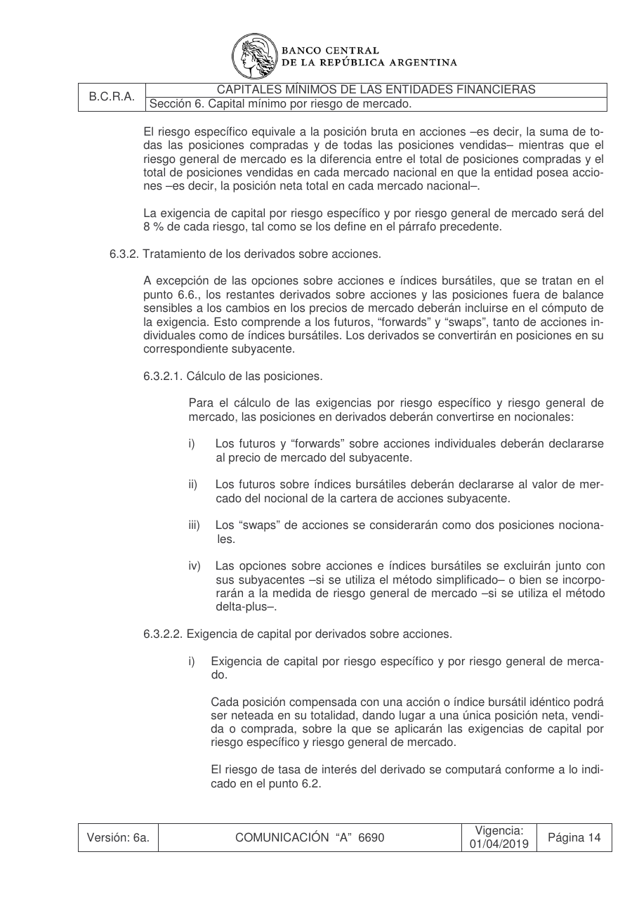
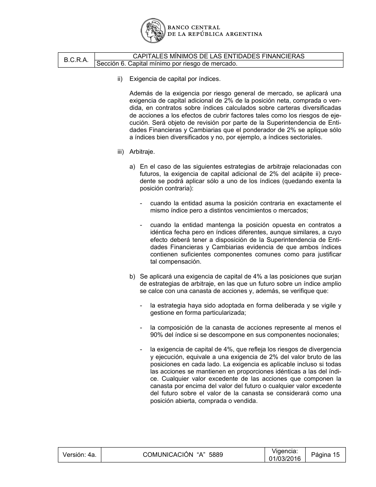
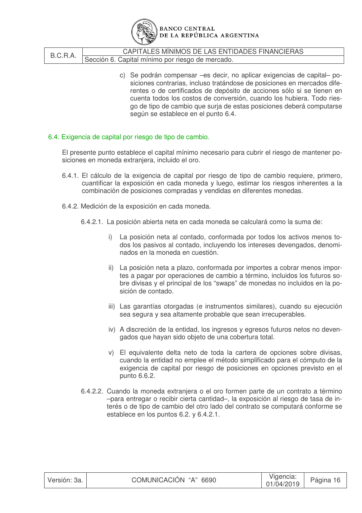

# Ficha L1-16 (lote 1, 16 de 20)

- Elemento: `Excepcion_exencion_de_la_exigencia_de_capital_adicional_de_2_cuando_la_entidad_asume_la_po_02af66#u0`
- Nodo: Excepcion, «Exención exigencia 2% — arbitraje mismo índice distintos vencimientos»
- Descripción del nodo (salida del extractor; no es la referencia): «Exención de la exigencia de capital adicional de 2% cuando la entidad asume la posición contraria en exactamente el mismo índice pero a distintos vencimientos o mercados, quedando exenta la posición contraria.»

## Texto de la unidad de E0 (la referencia)

Unidad `cap::6.3.2.2`, «Exigencia de capital por derivados sobre acciones.», páginas [129, 130, 131]. PDF: `data/experiment/subset/TO_capitales_minimos_actual.pdf`.

La cuantía a juzgar va entre ⟦ ⟧.

**Texto propio** (páginas [129, 130, 131])

> 6.3.⟦2⟧.⟦2⟧. Exigencia de capital por derivados sobre acciones.
> i) Exigencia de capital por riesgo específico y por riesgo general de merca-
> do.
> Cada posición compensada con una acción o índice bursátil idéntico podrá
> ser neteada en su totalidad, dando lugar a una única posición neta, vendi-
> da o comprada, sobre la que se aplicarán las exigencias de capital por
> riesgo específico y riesgo general de mercado.
> El riesgo de tasa de interés del derivado se computará conforme a lo indi-
> cado en el punto 6.⟦2⟧.
> ii) Exigencia de capital por índices.
> Además de la exigencia por riesgo general de mercado, se aplicará una
> exigencia de capital adicional de ⟦2%⟧ de la posición neta, comprada o ven-
> dida, en contratos sobre índices calculados sobre carteras diversificadas
> de acciones a los efectos de cubrir factores tales como los riesgos de eje-
> cución. Será objeto de revisión por parte de la Superintendencia de Enti-
> dades Financieras y Cambiarias que el ponderador de ⟦2%⟧ se aplique sólo
> a índices bien diversificados y no, por ejemplo, a índices sectoriales.
> iii) Arbitraje.
> a) En el caso de las siguientes estrategias de arbitraje relacionadas con
> futuros, la exigencia de capital adicional de ⟦2%⟧ del acápite ii) prece-
> dente se podrá aplicar sólo a uno de los índices (quedando exenta la
> posición contraria):
> - cuando la entidad asuma la posición contraria en exactamente el
> mismo índice pero a distintos vencimientos o mercados;
> - cuando la entidad mantenga la posición opuesta en contratos a
> idéntica fecha pero en índices diferentes, aunque similares, a cuyo
> efecto deberá tener a disposición de la Superintendencia de Enti-
> dades Financieras y Cambiarias evidencia de que ambos índices
> contienen suficientes componentes comunes como para justificar
> tal compensación.
> b) Se aplicará una exigencia de capital de 4% a las posiciones que surjan
> de estrategias de arbitraje, en las que un futuro sobre un índice amplio
> se calce con una canasta de acciones y, además, se verifique que:
> - la estrategia haya sido adoptada en forma deliberada y se vigile y
> gestione en forma particularizada;
> - la composición de la canasta de acciones represente al menos el
> 90% del índice si se descompone en sus componentes nocionales;
> - la exigencia de capital de 4%, que refleja los riesgos de divergencia
> y ejecución, equivale a una exigencia de ⟦2%⟧ del valor bruto de las
> posiciones en cada lado. La exigencia es aplicable incluso si todas
> las acciones se mantienen en proporciones idénticas a las del índi-
> ce. Cualquier valor excedente de las acciones que componen la
> canasta por encima del valor del futuro o cualquier valor excedente
> del futuro sobre el valor de la canasta se considerará como una
> posición abierta, comprada o vendida.
> c) Se podrán compensar –es decir, no aplicar exigencias de capital– po-
> siciones contrarias, incluso tratándose de posiciones en mercados dife-
> rentes o de certificados de depósito de acciones sólo si se tienen en
> cuenta todos los costos de conversión, cuando los hubiera. Todo ries-
> go de tipo de cambio que surja de estas posiciones deberá computarse
> según se establece en el punto 6.4.

**Heredado, bloque 1 (encabezado, de S6)** (páginas [116])

> Sección 6. Capital mínimo por riesgo de mercado.

**Heredado, bloque 2 (encabezado, de 6.3)** (páginas [128])

> 6.3. Exigencia de capital por riesgo de posiciones en acciones.

**Heredado, bloque 3 (intro, de 6.3)** (páginas [128])

> La exigencia de capital por el riesgo de mantener posiciones en acciones en la cartera de ne-
> gociación alcanza a las posiciones compradas y vendidas en acciones ordinarias, títulos de
> deuda convertibles que se comporten como acciones y los compromisos para adquirir o ven-
> der acciones, así como en todo otro instrumento que tenga un comportamiento en el mercado
> similar al de las acciones, excluyendo a las acciones preferidas no convertibles, a las que se
> aplicará la exigencia por riesgo de tasa de interés descripta en el punto 6.⟦2⟧. Las posiciones
> compradas y vendidas en la misma especie podrán computarse en términos netos.

**Heredado, bloque 4 (encabezado, de 6.3.2)** (páginas [129])

> 6.3.⟦2⟧. Tratamiento de los derivados sobre acciones.

**Heredado, bloque 5 (intro, de 6.3.2)** (páginas [129])

> A excepción de las opciones sobre acciones e índices bursátiles, que se tratan en el
> punto 6.6., los restantes derivados sobre acciones y las posiciones fuera de balance
> sensibles a los cambios en los precios de mercado deberán incluirse en el cómputo de
> la exigencia. Esto comprende a los futuros, “forwards” y “swaps”, tanto de acciones in-
> dividuales como de índices bursátiles. Los derivados se convertirán en posiciones en su
> correspondiente subyacente.

**Avisos**

- la cuantía aparece 9 veces en el texto y van resaltadas todas; el paso 1 se responde por la que corresponde a la regla del nodo

## Tramos de umbral que E1 devolvió para este nodo

E1 no devolvió tramos de umbral para este nodo (crudo: extracciones_e1_compact.jsonl).

## Página del PDF

## Paso 1

Se responde en el formulario del lote (`formulario_paso1_lote1.md`), bloque L1-16.
