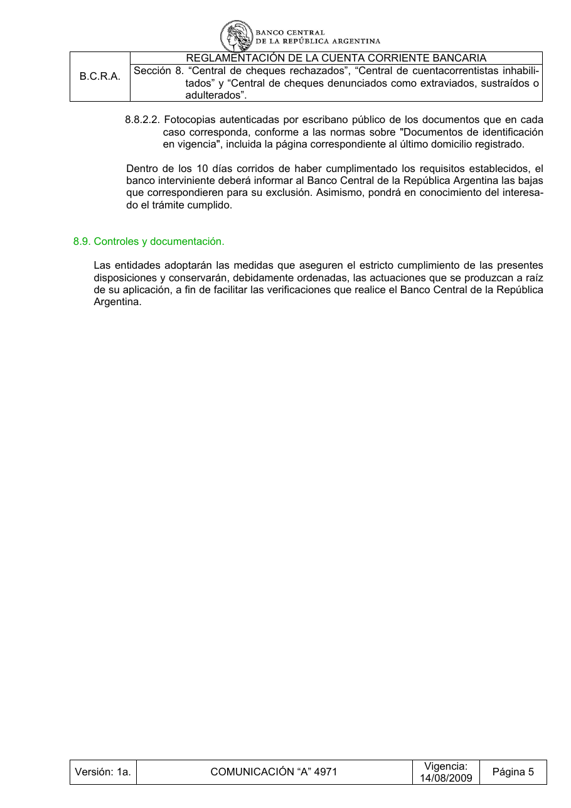

# Ficha L1-17 (lote 1, 17 de 20)

- Elemento: `Obligacion_el_banco_interviniente_debe_informar_al_banco_central_de_la_republica_argentina__dcc557#u0`
- Nodo: Obligacion, «Informe de bajas al BCRA — 10 días»
- Descripción del nodo (salida del extractor; no es la referencia): «El banco interviniente debe informar al Banco Central de la República Argentina las bajas que correspondan para la exclusión de las personas, dentro de los 10 días corridos de cumplimentados los requisitos»

## Texto de la unidad de E0 (la referencia)

Unidad `ctacte::8.8.2.2`, «Fotocopias autenticadas por escribano público de los documentos que en cada», páginas [48]. PDF: `data/experiment/escalado_prep/pdfs/ctacte.pdf`.

La cuantía a juzgar va entre ⟦ ⟧.

**Texto propio** (páginas [48])

> 8.8.2.2. Fotocopias autenticadas por escribano público de los documentos que en cada
> caso corresponda, conforme a las normas sobre "Documentos de identificación
> en vigencia", incluida la página correspondiente al último domicilio registrado.

**Heredado, bloque 1 (encabezado, de S8)** (páginas [44])

> Sección 8. “Central de cheques rechazados”, “Central de cuentacorrentistas inhabili- tados” y “Central de cheques denunciados como extraviados, sustraídos o adulterados”.

**Heredado, bloque 2 (encabezado, de 8.8)** (páginas [47])

> 8.8. Exclusión de personas comprendidas.

**Heredado, bloque 3 (encabezado, de 8.8.2)** (páginas [47])

> 8.8.2. Apertura de cuentas con documentación apócrifa.

**Heredado, bloque 4 (intro, de 8.8.2)** (páginas [47])

> A fin de ser excluidas de la “Central de cheques rechazados” y/o de la “Central de cuen-
> tacorrentistas inhabilitados”, las personas que hayan sido incorporadas a ellas como
> consecuencia de ese motivo deberán efectuar una presentación ante el banco que haya
> informado los rechazos en la que expongan sucintamente los hechos acontecidos, junto
> con los siguientes elementos:

**Heredado, bloque 5 (cierre, de 8.8.2)** (páginas [48])

> Dentro de los ⟦10 días corridos⟧ de haber cumplimentado los requisitos establecidos, el
> banco interviniente deberá informar al Banco Central de la República Argentina las bajas
> que correspondieren para su exclusión. Asimismo, pondrá en conocimiento del interesa-
> do el trámite cumplido.

## Tramos de umbral que E1 devolvió para este nodo

Del crudo de E1 guardado en `corpus_tanda0/salida_r2b/ctacte/` (extracciones_e1_compact.jsonl):

1. «Dentro de los 10 días corridos» (unidad `ctacte::8.8.2.2`) ← contiene lo resaltado

## Página del PDF

## Paso 1

Se responde en el formulario del lote (`formulario_paso1_lote1.md`), bloque L1-17.
