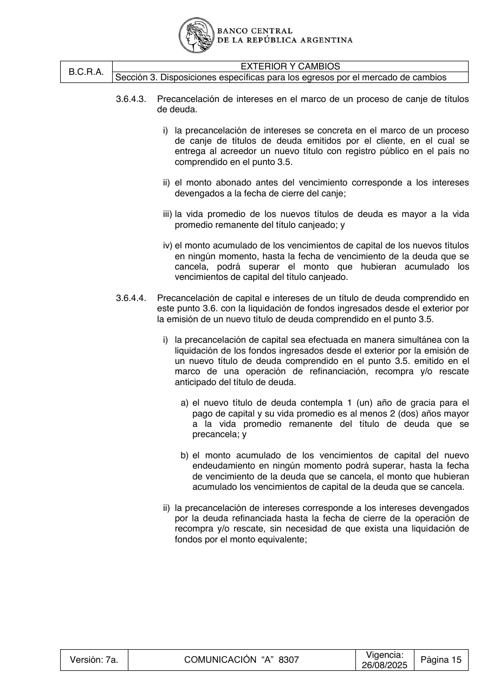
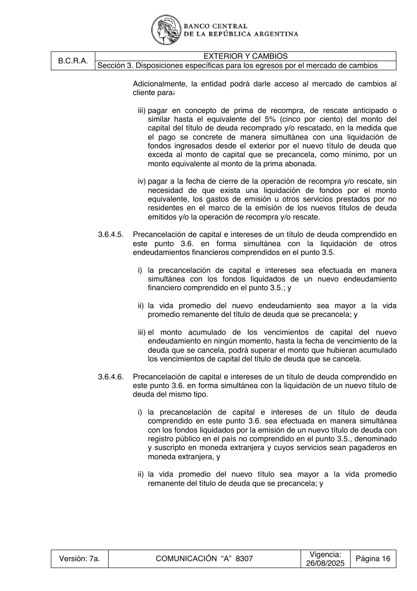

# Ficha L1-18 (lote 1, 18 de 20)

- Elemento: `Restriccion_el_monto_acumulado_de_los_vencimientos_de_capital_del_nuevo_endeudamiento_no_pod_60b35d#u0`
- Nodo: Restriccion, «Límite monto acumulado vencimientos capital nuevo endeudamiento»
- Descripción del nodo (salida del extractor; no es la referencia): «El monto acumulado de los vencimientos de capital del nuevo endeudamiento no podrá superar, hasta la fecha de vencimiento de la deuda que se cancela, el monto que hubieran acumulado los vencimientos de capital de la deuda que se cancela.»

## Texto de la unidad de E0 (la referencia)

Unidad `ext::3.6.4.4`, «Precancelación de capital e intereses de un título de deuda comprendido en», páginas [30, 31]. PDF: `data/experiment/subset/TO_exterior_cambios_actual.pdf`.

El tramo del elemento va entre ⟦ ⟧.

**Texto propio** (páginas [30, 31])

> 3.6.4.4. Precancelación de capital e intereses de un título de deuda comprendido en
> este punto 3.6. con la liquidación de fondos ingresados desde el exterior por
> la emisión de un nuevo título de deuda comprendido en el punto 3.5.
> i) la precancelación de capital sea efectuada en manera simultánea con la
> liquidación de los fondos ingresados desde el exterior por la emisión de
> un nuevo título de deuda comprendido en el punto 3.5. emitido en el
> marco de una operación de refinanciación, recompra y/o rescate
> anticipado del título de deuda.
> a) el nuevo título de deuda contempla 1 (un) año de gracia para el
> pago de capital y su vida promedio es al menos 2 (dos) años mayor
> a la vida promedio remanente del título de deuda que se
> precancela; y
> b) el monto acumulado de los vencimientos de capital del nuevo
> endeudamiento ⟦en ningún momento podrá superar, hasta la fecha
> de vencimiento de la deuda que se cancela⟧, el monto que hubieran
> acumulado los vencimientos de capital de la deuda que se cancela.
> ii) la precancelación de intereses corresponde a los intereses devengados
> por la deuda refinanciada hasta la fecha de cierre de la operación de
> recompra y/o rescate, sin necesidad de que exista una liquidación de
> fondos por el monto equivalente;
> Adicionalmente, la entidad podrá darle acceso al mercado de cambios al
> cliente para:
> iii) pagar en concepto de prima de recompra, de rescate anticipado o
> similar hasta el equivalente del 5% (cinco por ciento) del monto del
> capital del título de deuda recomprado y/o rescatado, en la medida que
> el pago se concrete de manera simultánea con una liquidación de
> fondos ingresados desde el exterior por el nuevo título de deuda que
> exceda al monto de capital que se precancela, como mínimo, por un
> monto equivalente al monto de la prima abonada.
> iv)pagar a la fecha de cierre de la operación de recompra y/o rescate, sin
> necesidad de que exista una liquidación de fondos por el monto
> equivalente, los gastos de emisión u otros servicios prestados por no
> residentes en el marco de la emisión de los nuevos títulos de deuda
> emitidos y/o la operación de recompra y/o rescate.

**Heredado, bloque 1 (encabezado, de S3)** (páginas [16])

> Sección 3. Disposiciones específicas para los egresos por el mercado de cambios

**Heredado, bloque 2 (chapeau_seccion, de S3)** (páginas [16])

> Las entidades previamente a dar acceso al mercado de cambio por las operaciones comprendidas
> en los puntos 3.1. a 3.15. –incluyendo aquellas que se concreten a través de canjes o arbitrajes–,
> adicionalmente a los requisitos y condiciones específicas detalladas en cada punto, deberán
> cumplimentar los requisitos complementarios que constan en el punto 3.16. que resulten aplicables.

**Heredado, bloque 3 (encabezado, de 3.6)** (páginas [28])

> 3.6. Pagos de títulos de deuda u otros valores representativos de deuda denominados y

**Heredado, bloque 4 (intro, de 3.6)** (páginas [28])

> pagaderos en moneda extranjera en el país y obligaciones en moneda extranjera entre
> residentes.

**Heredado, bloque 5 (encabezado, de 3.6.4)** (páginas [29])

> 3.6.4. El acceso al mercado de cambios con anterioridad al vencimiento requerirá la

**Heredado, bloque 6 (intro, de 3.6.4)** (páginas [29])

> conformidad previa del BCRA excepto que la operación encuadre en alguna de las
> siguientes situaciones y se cumplan la totalidad de las condiciones estipuladas en cada
> caso:

## Tramos de umbral que E1 devolvió para este nodo

Del crudo de E1 guardado en `corpus_tanda0/salida_r2b/ext/` (extracciones_e1_compact.jsonl):

1. «en ningún momento podrá superar, hasta la fecha de vencimiento de la deuda que se cancela» (unidad `ext::3.6.4.4`) ← contiene lo resaltado

## Página del PDF

## Paso 1

Se responde en el formulario del lote (`formulario_paso1_lote1.md`), bloque L1-18.
