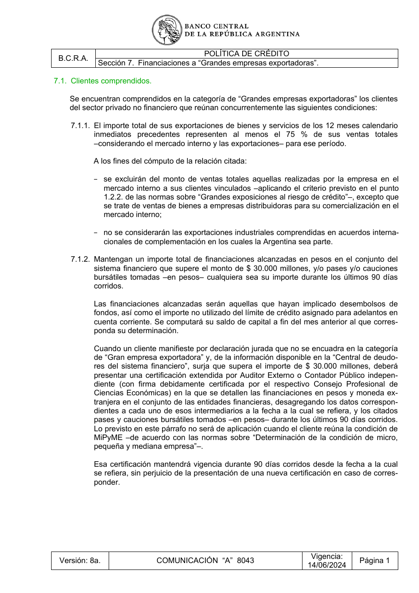

# Ficha L1-19 (lote 1, 19 de 20)

- Elemento: `Condicion_exportaciones_75_ventas_totales_12_meses__el_cliente_debe_cumplir_que_sus_export_6e4266#u0`
- Nodo: Condicion, «Exportaciones ≥75% ventas totales 12 meses»
- Descripción del nodo (salida del extractor; no es la referencia): «El cliente debe cumplir que sus exportaciones de bienes y servicios de los últimos 12 meses calendario representen al menos el 75% de sus ventas totales (mercado interno más exportaciones)»

## Texto de la unidad de E0 (la referencia)

Unidad `polcre::7.1.1`, «El importe total de sus exportaciones de bienes y servicios de los 12 meses calendario», páginas [18]. PDF: `data/experiment/escalado_prep/pdfs/polcre.pdf`.

La cuantía a juzgar va entre ⟦ ⟧.

**Texto propio** (páginas [18])

> 7.1.1. El importe total de sus exportaciones de bienes y servicios de los 12 meses calendario
> inmediatos precedentes representen al menos el ⟦75 %⟧ de sus ventas totales
> –considerando el mercado interno y las exportaciones– para ese período.
> A los fines del cómputo de la relación citada:
> − se excluirán del monto de ventas totales aquellas realizadas por la empresa en el
> mercado interno a sus clientes vinculados –aplicando el criterio previsto en el punto
> 1.2.2. de las normas sobre “Grandes exposiciones al riesgo de crédito”–, excepto que
> se trate de ventas de bienes a empresas distribuidoras para su comercialización en el
> mercado interno;
> − no se considerarán las exportaciones industriales comprendidas en acuerdos interna-
> cionales de complementación en los cuales la Argentina sea parte.

**Heredado, bloque 1 (encabezado, de S7)** (páginas [18])

> Sección 7. Financiaciones a “Grandes empresas exportadoras”.

**Heredado, bloque 2 (encabezado, de 7.1)** (páginas [18])

> 7.1. Clientes comprendidos.

**Heredado, bloque 3 (intro, de 7.1)** (páginas [18])

> Se encuentran comprendidos en la categoría de “Grandes empresas exportadoras” los clientes
> del sector privado no financiero que reúnan concurrentemente las siguientes condiciones:

**Heredado, bloque 4 (cierre, de 7.1)** (páginas [19])

> Cuando el cliente reúna la condición del punto 7.1.1. pero el importe total de sus financiaciones
> en pesos en el sistema financiero no supere el importe de $ 30.000 millones y no haya mante-
> nido pases y/o cauciones bursátiles tomadas –en pesos– durante los últimos 90 días corridos,
> la entidad financiera podrá otorgarle nuevas financiaciones en la medida que con tales desem-
> bolsos no se supere ese importe.
> Cuando se trate de conjuntos económicos se los considerará como un solo cliente, a cuyo
> efecto será de aplicación el punto 1.2.2. de las normas sobre “Grandes exposiciones al riesgo
> de crédito”.
> A los fines de la imputación de las financiaciones, será de aplicación lo previsto en las normas
> sobre “Grandes exposiciones al riesgo de crédito”.

## Tramos de umbral que E1 devolvió para este nodo

Del crudo de E1 guardado en `corpus_tanda0/salida_r2b/polcre/` (extracciones_e1_compact.jsonl):

1. «al menos el 75 %» (unidad `polcre::7.1.1`) ← contiene lo resaltado

## Página del PDF

## Paso 1

Se responde en el formulario del lote (`formulario_paso1_lote1.md`), bloque L1-19.
