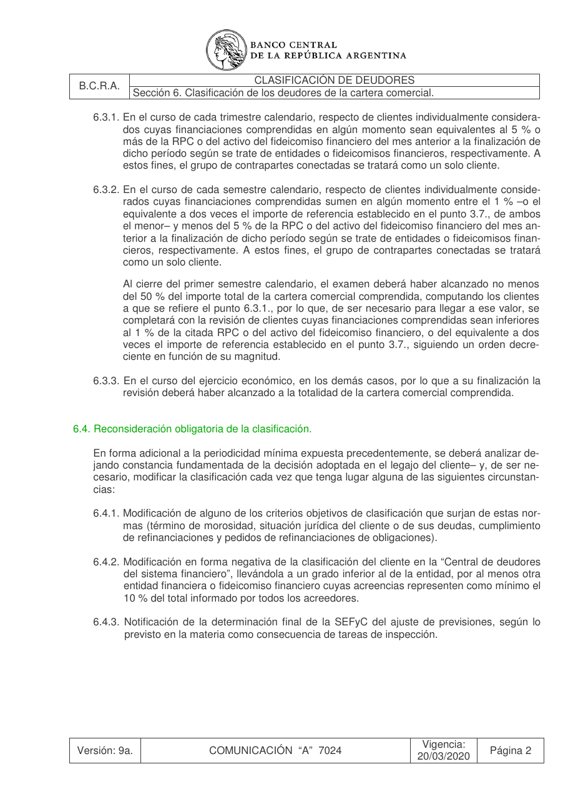

# Ficha L1-20 (lote 1, 20 de 20)

- Elemento: `Condicion_condicion_de_ser_necesario_para_alcanzar_50__la_revision_de_clientes_inferiores__b1de3d#u1`
- Nodo: Condicion, «Condición — de ser necesario para alcanzar 50%»
- Descripción del nodo (salida del extractor; no es la referencia): «La revisión de clientes inferiores al 1% se realiza de ser necesario para alcanzar el 50% del importe total de la cartera comercial comprendida.»

## Texto de la unidad de E0 (la referencia)

Unidad `cla::6.3.2`, «En el curso de cada semestre calendario, respecto de clientes individualmente conside-», páginas [18]. PDF: `data/experiment/subset/TO_clasificacion_deudores_actual.pdf`.

La cuantía a juzgar va entre ⟦ ⟧.

**Texto propio** (páginas [18])

> 6.3.2. En el curso de cada semestre calendario, respecto de clientes individualmente conside-
> rados cuyas financiaciones comprendidas sumen en algún momento entre el 1 % –o el
> equivalente a dos veces el importe de referencia establecido en el punto 3.7., de ambos
> el menor– y menos del 5 % de la RPC o del activo del fideicomiso financiero del mes an-
> terior a la finalización de dicho período según se trate de entidades o fideicomisos finan-
> cieros, respectivamente. A estos fines, el grupo de contrapartes conectadas se tratará
> como un solo cliente.
> Al cierre del primer semestre calendario, el examen deberá haber alcanzado no menos
> del ⟦50⟧ % del importe total de la cartera comercial comprendida, computando los clientes
> a que se refiere el punto 6.3.1., por lo que, de ser necesario para llegar a ese valor, se
> completará con la revisión de clientes cuyas financiaciones comprendidas sean inferiores
> al 1 % de la citada RPC o del activo del fideicomiso financiero, o del equivalente a dos
> veces el importe de referencia establecido en el punto 3.7., siguiendo un orden decre-
> ciente en función de su magnitud.

**Heredado, bloque 1 (encabezado, de S6)** (páginas [17])

> Sección 6. Clasificación de los deudores de la cartera comercial.

**Heredado, bloque 2 (encabezado, de 6.3)** (páginas [17])

> 6.3. Periodicidad mínima de clasificación.

**Heredado, bloque 3 (intro, de 6.3)** (páginas [17])

> La revisión deberá efectuarse como mínimo con la periodicidad que se indica seguidamente,
> dejando constancia de ello en el legajo del cliente analizado:

## Tramos de umbral que E1 devolvió para este nodo

E1 no devolvió tramos de umbral para este nodo (crudo: extracciones_e1_compact.jsonl).

## Página del PDF

## Paso 1

Se responde en el formulario del lote (`formulario_paso1_lote1.md`), bloque L1-20.
