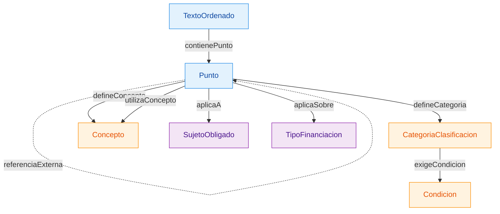
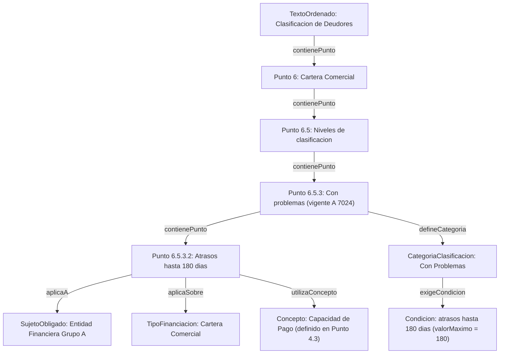
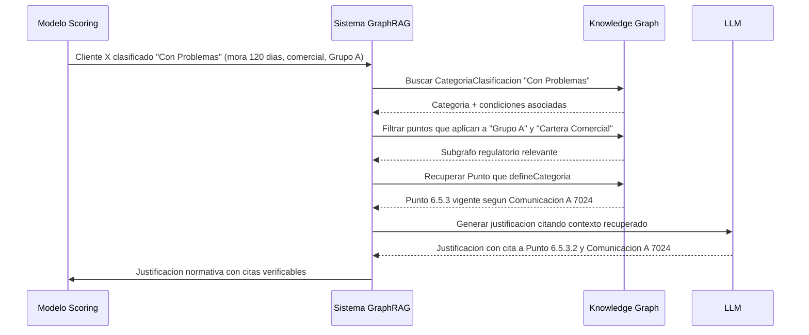

# Schema v0.1 — Diagrama visual

**Versión:** 0.1
**Fecha:** 2026-04-29
**Acompaña a:** `schema-v0.1.md`

Este archivo presenta el schema en dos vistas: la estructura abstracta del modelo (clases y relaciones) y un ejemplo poblado con datos reales del Texto Ordenado de Clasificación de Deudores.

---

## Vista 1 — Estructura del schema

Diagrama de clases y relaciones del modelo. Muestra qué tipos de entidades existen y cómo se conectan entre sí.

**Leyenda de colores:**
- Azul: clases estructurales (representan el documento físico)
- Naranja: clases semánticas (representan el contenido normativo)
- Violeta: clases de aplicabilidad (a quién/qué aplica)

- Texto Ordenado --> un documento publicado por el BCRA que consolida toda la regulación vigente sobre un tema. Es el "PDF entero" como entidad.
- Punto --> una unidad de contenido dentro de un Texto Ordenado. Tiene numeración X.Y.Z... Es la entidad más importante del grafo: todo el contenido normativo vive dentro de Puntos. La mayoría de las relaciones del schema parten de Punto o llegan a Punto.
- Categoría Clasificación --> las etiquetas operacionales que la regulación define para clasificar deudores. Ejemplos: "Situación Normal", "En Observación", "Con Problemas", "Con Alto Riesgo de Insolvencia", "Irrecuperable"

Por ejemplo: El Punto 6.5.3 es el lugar del documento donde se define la categoría. La CategoriaClasificacion "Con Problemas" es la categoría en sí, como concepto. 
- Condición -->  los requisitos individuales que un cliente debe cumplir para entrar en una categoría. Ejemplo: la categoría "Con Problemas" exige varias condiciones, entre ellas "Atrasos de hasta 180 días" (con valor numérico extraíble: 180), "Situación financiera ilíquida", "Refinanciaciones reiteradas". Cada una de estas frases es una CONDICIÓN, las condiciones se pueden compartir entre categorías.
- Concepto --> términos técnicos que la regulación define formalmente y reutiliza en muchos lugares. Ejemplo: "Capacidad de pago", "Flujo de fondos", "Responsabilidad Patrimonial Computable" (RPC), "Cartera comercial". Un concepto se define en un lugar (ej. "Capacidad de pago" se define en el Punto 4.3) pero se usa en muchos otros (ej. el Punto 6.2 lo usa, el Punto 7.1 lo usa). 
- SujetoObligado --> a quién le aplica la regulación. No son los deudores, son las entidades reguladas (los bancos y otras instituciones financieras). Ejemplos: "Entidad Financiera Grupo A" (los bancos grandes), "Entidad Financiera Grupo B", "Fideicomisos Financieros", "Sociedades de Garantía Recíproca". Es importante porque algunas reglas aplican solo a ciertos tipos de instituciones. 
- TipoFinanciacion --> sobre qué tipo de operación de crédito rige una regla. Ejemplos: "Cartera comercial", "Cartera de consumo", "Cartera de vivienda", "Préstamos a MiPyMEs". Es importante porque las reglas de clasificación cambian según el tipo. La Sección 6 del documento es para cartera comercial, la Sección 7 es para consumo y vivienda. Son reglas distintas para tipos distintos.

**Nota sobre Comunicación:** se modela como propiedad del nodo Punto (`vigenteSegunComunicacion`, `fechaVigencia`), no como clase independiente. 

---

## Vista 2 — Ejemplo poblado con datos reales

Instanciación del schema con un fragmento del Texto Ordenado de Clasificación de Deudores. Muestra cómo se vería el grafo cuando se carga con contenido del corpus real.

**Caso modelado:** Punto 6.5.3 ("Con problemas") y Punto 6.5.3.2 (condición de atraso de hasta 180 días) de la cartera comercial.

---

## Cómo leer este ejemplo

El grafo de arriba representa este fragmento del documento:

> "Sección 6, Punto 5, Subpunto 3 (Con problemas): el cliente se clasifica en esta categoría si, entre otras condiciones, incurre en atrasos de hasta 180 días en el pago de sus obligaciones. Esta categoría aplica a entidades financieras del Grupo A en operaciones de cartera comercial. Para evaluar la categoría se utiliza el concepto de Capacidad de Pago definido en el Punto 4.3."

**Lo que el grafo permite responder:**

1. **Pregunta jerárquica:** "¿Qué Texto Ordenado contiene el Punto 6.5.3.2?"
   Recorrer hacia arriba por contienePunto: TO Clasificación de Deudores.

2. **Pregunta de aplicación:** "¿Qué condiciones debe cumplir un cliente para ser clasificado como Con Problemas?"
   Buscar la categoría, seguir exigeCondicion, recuperar todas las condiciones.

3. **Pregunta de filtrado:** "¿Esta regla aplica a mi banco (Grupo A) y al tipo de operación (Comercial)?"
   Verificar aplicaA y aplicaSobre.

4. **Pregunta cuantitativa:** "¿Qué categorías permiten atrasos mayores a 90 días?"
   Filtrar nodos Condicion por valorMaximo > 90, seguir exigeCondicion inverso, recuperar categorías.

5. **Pregunta de trazabilidad normativa:** "¿En qué versión de la regulación está vigente este punto?"
   Leer la propiedad vigenteSegunComunicacion del Punto.

---

## Vista 3 — Pregunta de justificación end-to-end

Cómo se usaría el grafo en la práctica para generar una justificación normativa.

---

## Decisiones de modelado reflejadas en este diagrama

1. **Punto recursivo, no clases por nivel:** una sola clase Punto que se contiene a sí misma, en lugar de Sección/Subsección/etc. Confirmado por evidencia en el corpus: 5 niveles de profundidad observados.

2. **Comunicación como propiedad, no como nodo:** decisión inicial para v0.1, abierta a discusión.

3. **Condiciones con valores cuantitativos extraídos:** ejemplo modelado con valorMaximo 180. Refleja la opción híbrida de la Decisión 2 abierta.

4. **Categoría como entidad separada del Punto:** porque las categorías son conceptos citables independientes que aparecen en justificaciones normativas, no detalles internos del documento.

5. **Conceptos como nodos:** permiten conectar definiciones (Punto 4.3 define Capacidad de Pago) con usos (Punto 6.2 utiliza Capacidad de Pago).

---

## Cómo regenerar o editar los diagramas

Los diagramas usan sintaxis Mermaid. Para visualizar:

- En Cursor: Cmd+Shift+V abre la preview de markdown con los diagramas renderizados.
- En GitHub: se renderizan automáticamente en el archivo del repo.
- Para editarlos online: copiar el bloque mermaid en https://mermaid.live/